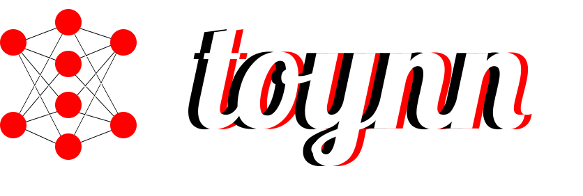

<p align="center">
  
</p>
<p align="center">A toy NN library for JS to play and learn NN concepts.</p>
<p align="center">


<a href="https://github.com/pratyushtiwary/toynn/actions/workflows/publish.yml">

</a>
<a href="https://codecov.io/gh/pratyushtiwary/toynn" >

</a>
</p>
<p align="center">
  <b>Contribution is much appreciated, if you feel like something is not right or you've found some bug feel free to raise an issue or create a PR</b>
</p>

## Requirements

[NodeJS](https://nodejs.org/) v18.0.0 or higher must be installed to use `toynn`.

## Installation

| **Source** | **Info**            |
| ---------- | ------------------- |
| npm        | `npm install toynn` |
| yarn       | `yarn add toynn`    |

## Usage

```js
import toynn from "toynn";

const X = [
  new toynn.NArray([0, 0]).reshape(1, 2),
  new toynn.NArray([0, 1]).reshape(1, 2),
  new toynn.NArray([1, 0]).reshape(1, 2),
  new toynn.NArray([1, 1]).reshape(1, 2),
];

const y = [
  new toynn.NArray([0]),
  new toynn.NArray([0]),
  new toynn.NArray([0]),
  new toynn.NArray([1]),
];

const model = new toynn.NN("and");

const layer1 = new toynn.Layer(2, 3);
layer1.use(toynn.functions.linear);
const layer2 = new toynn.Layer(3, 1);
layer2.use(toynn.functions.sigmoid);

model.add(layer1);
model.add(layer2);

model.train({
  x: X,
  y,
  epochs: 500,
  alpha: 0.001,
  loss: toynn.errors.MSE,
  verbose: true,
});

let newData = new toynn.NArray([1, 0]).reshape(1, 2);
// make prediction
console.log(model.forward(newData).flatten());
```

**Note: The above code only supports v2.0.0 or above**

**You can use the library with typescript also. The code remains the same.**

## Docs

Docs can be found [here](https://toynn.vercel.app/).
